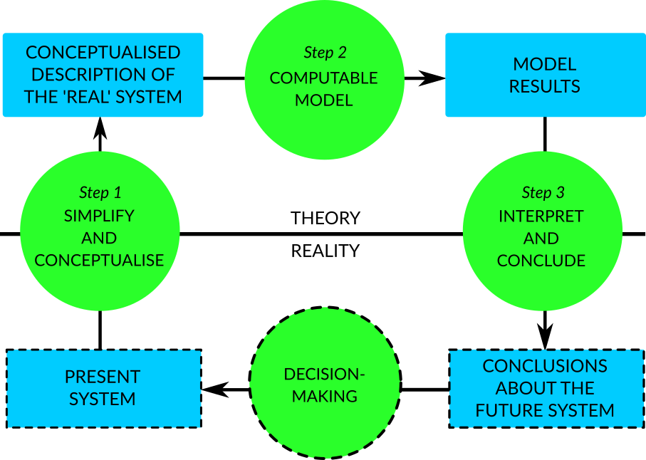
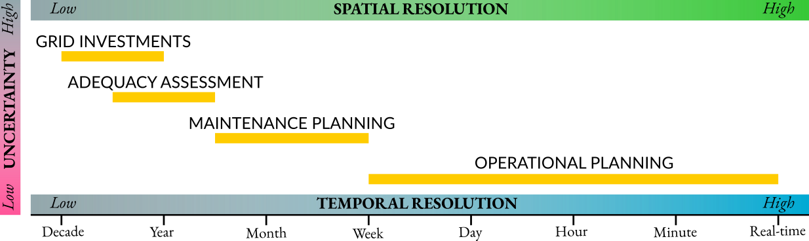

Background
==========

The energy transition
---------------------

The transition towards a future low-carbon economy is driven globally by the Paris Agreement [UNFCCC2015]_, which recognises the need for sustainable development worldwide to counter the threats of climate change. The European Union (:term:`EU`\) is committed to reduce greenhouse gas (:term:`GHG`\) emissions by 2050 to 80-90 % below 1990 levels [EuropeanCommission2012]_. As the energy industry is responsible for the highest share of anthropogenic :term:`GHG`\  emissions [EuropeanCommission2012]_, importance is placed on how changes in energy systems can help achieve these :term:`GHG`\  emission reduction targets.

A number of opportunities exist for the decarbonisation of the energy industry. The International Renewable Energy Agency (:term:`IRENA`\), in their renewable energy roadmap study, has identified renewable energy as having the highest potential in reducing energy-related carbon dioxide emissions globally, which is closely followed by energy efficiency and electrification with renewable energy [IRENA2018]_. In a 2018 political agreement, the :term:`EU`\  member states agreed upon a target of at least 32 % of the demand being met with renewables by 2030, through national targets of the individual member states [EuropeanCommission]_. The electricity demand in the transport sector is also expected to increase due to expected petrol and diesel engine bans and subsequently the electrification of road transport [IEA2017]_.

Conventional energy resources, such as fossil fuels, biomass, hydro, geothermal, and nuclear fuels are non-variable. Fossil fuels, including coal, natural gas, and oil, as well as nuclear, are non-renewable. While nuclear, biomass, hydro, and geothermal energy are clean and/or renewable, generating power from fossil fuels or hydrocarbons involve combustion, which is a process that releases carbon dioxide and harmful by-products, such as soot. Fossil fuels are still extensively used and depended upon in industries around the world, including transport, chemicals, and power generation. As a result, the focus of the energy transition is to move away from fossil fuels to cleaner energy resources and technologies, including variable renewable energy (:term:`VRE`\) resources such as solar and wind. According to the :term:`EU`\  reference scenario 2016 [EUOpenData]_, wind and solar energy resources are expected to generate a total of 35 % of :term:`EU`\'s electricity by 2050, which is a significant increase (23 %) from 2015 levels. Conversely, generation from nuclear and solids, which are not variable and provide base load generation, are expected to decrease significantly.

While fossil fuels can be stored, transported, combusted, and converted into more useful forms of energy when there is a demand, generation from :term:`VRE`\  resources cannot be controlled to follow consumption patterns in the same way. :term:`VRE`\  resources are intermittent as they are dependent on atmospheric conditions, such as cloud cover and wind speed. They also have variations temporally (time-based) and spatially (location-based). This is a challenge to energy system operators, whose objective is to reliably and securely meet the energy needs at all times.

The energy system is also transitioning towards a decentralised system with more consumer participation and new forms of flexibilities, including sector coupling, demand-side management (:term:`DSM`\), energy conversion and storage, cross-border interconnection, and curtailment. This allows demand patterns to shift to better suit the generation patterns in systems with high penetration of :term:`VRE`\  resources [EliaGroup2018]_, such as solar and wind. This decentralised, flexible, and renewable energy system is more complex than traditional centralised systems, and require improved decision making processes for an optimal system operation. As the energy system is also becoming "smart" [Lund2017]_, the system will have an increasing amount of sensors and controllers that continuously record measurements of the system. Advancements in these technologies mean that data that is fast, heterogeneous and high in volume from the energy system will be generated [IBM2012]_. This provides an opportunity to exploit data with these characteristics to gain insights on the energy system, which can then be converted to strategies that optimise the system.

Energy system modelling and decision making in various resolutions
------------------------------------------------------------------

Energy systems models are tools used to project the future energy supply of a country or region [Herbst2012]_. The figure below explains the energy systems modelling process using a system analysis approach [Krook-Riekkola2015]_. This process starts with creating a model of the actual energy system by simplifying and conceptualising the present system. This conceptualised system with all assumptions is then mathematically solved to produce numerical results. These results can then be interpreted and conclusions can be drawn regarding the future energy system. Such conclusions form the evidence-base for decision makers, resulting in policy implications that help achieve these climate targets. This same approach can be used to explain various decision making processes for an energy system at various scales, other than policy making, as energy systems exist in different resolutions and levels of uncertainty.

    The system analysis approach applied on the energy system modelling process, adapted from Krook-Riekkola 2015.

The figure below represents the different scales of energy systems, mainly in terms of temporal resolution, but also uncertainty and spatial resolution [Glismann2018]_, [Pfenninger2014]_. Temporally, "real-time" is referred to as the time of dispatch. It can be observed that the operational planning scale has high spatial and temporal resolution, and relatively low uncertainty. Operational planning includes dispatch planning and plant scheduling, which ranges from a few minutes to a week before dispatch. Maintenance planning can take a few weeks to years, as it involves upgrade and maintenance work which may require shut-down of units or assets, in turn affecting the availability of generation units and grid infrastructure. Adequacy assessments, which takes years, involve assessing the existing generation and storage capacities and planning for new installations based on demand projections, to ensure this demand will be met in the future. Finally, grid investment decisions, including planning transmission and distribution grid networks, cross-border and regional interconnections, and grid capacity expansions, take many years to decades and have very high uncertainty as a result.

    The various scales of energy systems in terms of their approximate temporal resolution, as well as spatial resolution and uncertainty, adapted from Glismann 2018 and Pfenninger, et al. 2014.

Existing models and tools
-------------------------

Ringkjøb, et al. [Ringkjob2018]_ reviewed a comprehensive list of energy systems models for systems with large shares of :term:`VRE`\  generation. They have classified existing energy systems models based on the developer, software availability (i.e., open-source, commercial), software type (e.g., stand-alone, General Algebraic Modeling System (:term:`GAMS`\)), purpose (e.g., power system analysis, scenario-based), modelling approach (bottom-up, top-down, hybrid), methodology (e.g., optimisation, simulation), temporal resolution, modelling horizon and spatial coverage. Additionally, information regarding the available conventional and renewable generation technologies, storage options, grid, demand sectors, demand elasticity, demand response, costs, market and emissions are provided.

Among the models listed by Ringkjøb, et al. are The Integrated MARKAL-EFOM System (:term:`TIMES`\) and MARKet ALlocation (:term:`MARKAL`\). The :term:`MARKAL`\  and :term:`TIMES`\  family of models, developed by the Energy Technology Systems Analysis Program (:term:`ETSAP`\) of the International Energy Agency (:term:`IEA`\), are bottom-up models that can generate economic models providing technology-rich basis for representing energy dynamics over a multi-period time horizon for local, national, multi-regional and global energy systems [IEA-ETSAP]_, [IEA-ETSAPa]_. Bottom-up models, also known as techno-economic or process-oriented models, have "relatively high degree of technological detail used to assess future energy demand and supply" and "use a business economics approach for the economic evaluation of the technologies simulated" [Herbst2012]_. :term:`ETSAP`\  reports that the :term:`MARKAL`\  and :term:`TIMES`\  models are being used by over 150 teams in 50 countries. Although widely used, these models focus on long time horizons and only perform a simplified supply and demand analysis for the electricity market and lack the detail to properly represent short-term fluctuations of :term:`VRE`\, making them unsuitable for operational planning. Additionally, :term:`TIMES`\  was only recently (in January 2020) released under an open source GNU General Public License (:term:`GNU GPL`\) [etsap-TIMES2020]_, but still requires the proprietary :term:`GAMS`\  language, solvers, and VEDA set of tools.

The methods used for forecasting in industry are commercial tools developed and maintained by energy consultancies, provide paid support to their customers. These models perform forecasting mainly using statistical and stochastic methods. Due to these tools being closed-source, no documentation or detailed information regarding these models are available publicly.

Transmission system operators (:term:`TSO`\s) make use of internal and commercial modelling tools when it comes to forecasting :term:`VRE`\  generation and demand. Example of commercial tools used for :term:`VRE`\  forecasting by :term:`TSO`\s in Great Britain include AWS Truepower, GH Forecaster (Garrad Hassan, now DNV-GL), PowerSight Wind Forecasting System (3Tier), Forecasting Tool (Element Energy) and Load Profile Modelling (Grid Scientific) [Hay2015]_.

AWS Truepower [UL]_ has a range of software for the operation of renewable energy projects, which includes access to time series measurements of wind and meteorological data at any time, a dashboard with visualisation of data, the ability to download data files, statistics and plot graphs, and support from the company’s consulting team.

DNV-GL's short-term energy forecasting service [DNV]_ is provided to wind and solar power plant operators. It is comprised of several forecasters, which has the ability to predict hourly wind and solar conditions up to 15 days in advance and update as quickly as every five minutes. The raw data can be provided in the plant operator’s choice of format. The service also includes interactive visualisation of data, both forecasts and historical measurements, and monthly reports and summaries.

Element Energy [ElementEnergy]_ is a specialist consultancy that has a load forecasting tool for identifying trends in future demand, generation and storage, as well as customer behaviour and technology deployment. Their forecasting model is of high resolution and is bottom-up. Apart from :term:`TSO`\s, distribution system operators (:term:`DSO`\s), also known as distribution network operators (:term:`DNO`\s), are also able to use this model for scenario-based cost-benefit analysis, as the grid flexibilities and smart grid services, including demand response and electric vehicle charging, are modelled in detail.

Grid Scientific [GridScientific]_ is a consultancy offering services related to information and communication technology and smart grids. No information regarding their Load Profile Modelling tool was available.

The electricity system
----------------------

The electricity system can be seen as having two components; the physical grid consisting of generators and transmission and distribution systems, and the electricity market consisting of a number of actors [Erbach2016]_.

The table below shows the characteristics of the main energy generation technologies, including their costs. These generation sources have different variabilities, fuel types, flexibilities, costs and carbon emissions. The costs listed in this table are derived based on National Renewable Energy Laboratory (:term:`NREL`\)'s NREL-SEAC 2008 Data Set [Tidball2010]_. :term:`VRE`\  generation technologies have high capital expenditure (:term:`CAPEX`\) compared to conventional fossil-powered and biomass generation. Conversely, the operational expenditure (:term:`OPEX`\), which includes fuel and fixed operational and maintenance (:term:`O&M`\) costs, is low for :term:`VRE`\  generation technologies, as they have no fuel costs unlike conventional generators [Joskow2011]_.

.. table:: Characteristics of the main energy generation technologies, adapted from Erbach 2016 and Tidball, et al. 2010. Costs for natural gas, biomass, solar and geothermal are that of advanced combustion turbine, biomass gasification plant, utility-scale photovoltaic and hydrothermal plant respectively. :term:`LCOE`\  refers to levelised cost of electricity. Biomass is considered low carbon as regrowth of biomass compensates emissions.

    =============== ============ ============= =============== ============== ========= ========= ===============
    Type            Variable     Fuel type     Flexibility     Low carbon     CAPEX     OPEX      LCOE
    =============== ============ ============= =============== ============== ========= ========= ===============
    Coal            no           fossil        medium          no             low       high      very low
    Natural gas     no           fossil        high            no             very low  very high low
    Biomass         no           renewable     medium          yes            low       very high very high
    Nuclear         no           nuclear       low             zero-emission  medium    medium    medium
    Hydro           no           renewable     very high       zero-emission                     
    Solar           yes          renewable     very low        zero-emission  very high very low  very high
    Wind            yes          renewable     very low        zero-emission                     
    *Onshore wind*                                                            high      very low  very low
    *Offshore wind*                                                           very high low       high
    Geothermal      no           renewable     high            zero-emission  high      medium    high
    =============== ============ ============= =============== ============== ========= ========= ===============

Actors in the electricity market include generators, retailers, large and small consumers, :term:`TSO`\s, :term:`DNO`\s, balance responsible parties (:term:`BRP`\s), aggregators, regulators, and market operators [KULeuven2015]_, [Pinson]_.

There are two types of electricity markets; the retail market and the wholesale market. The retail market involves the retailers buying electricity from generators and selling it to consumers. The wholesale market involves generators, retailers and (large) consumers, who buy and sell electricity. Energy-only transactions in the wholesale market have different temporal resolutions and take place before dispatch, shown in green in the figure below. Balancing markets, shown in pink in the figure, which involve both energy and services, operate both before and after dispatch. The energy-only markets are operated by the market operator or power exchanges, while the balancing market is operated by the system operator. The day-ahead and intra-day markets can be considered short-term electricity markets, as the former takes place 24 hours in advance of dispatch, while the latter takes place continuously after the day-ahead market, up to minutes before dispatch [EuropeanCommission2016]_.

.. figure:: images/market-resolution.png
    :alt: The various electricity markets in terms of operator and temporal resolution, before and after dispatch, adapted from KU Leuven Energy Institute 2015 and Pinson 2018.

    The various electricity markets in terms of operator and temporal resolution, before and after dispatch, adapted from KU Leuven Energy Institute 2015 and Pinson 2018.

In short-term electricity market auctions, such as the day-ahead market auction, generating companies have the incentive to bid as low as possible, as the supply bids are ranked in ascending order of price. Conversely, on the demand side, consumers have the incentive to bid as high as possible, as the demand bids are ranked in descending order of price. These two curves form a so called merit order, and the intersection between these two curves is the equilibrium point. The price at this equilibrium point is the market clearing price, which is what all accepted bids will receive, regardless of their initial bid. All supply and demand bids to the left of the equilibrium point will be accepted, and those to the right are rejected.

In the case of generating companies, the :term:`OPEX`\  of their generators determine the price at which it is bid. For conventional power plants, this :term:`OPEX`\  includes fuel costs and carbon costs (except nuclear power plants). For solar and wind power plants, the :term:`OPEX`\  is close to zero, as they do not require fuel to run. The revenue received by generating companies in the day-ahead market for each power plant contributes towards their :term:`CAPEX`\. Since conventional power plants have relatively low :term:`CAPEX`\, and fuel costs are high, the main decision generating companies have to make in short-term electricity markets is whether it is economical to run these power plants. For solar and wind power plants, which have relatively high :term:`CAPEX`\, companies are interested in getting as many bids accepted and as much of the electricity generated sold as possible.
