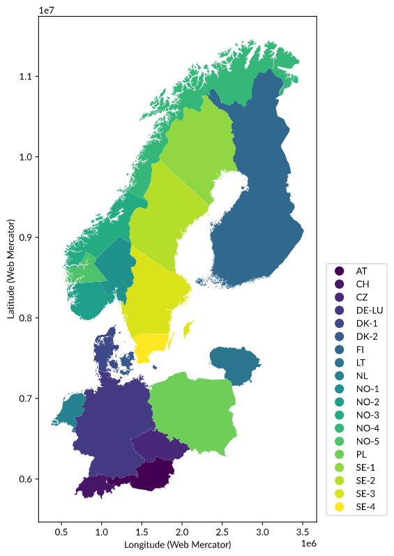

Regions
=======

In this section, the term 'focus countries' refers to four European countries: Germany, Denmark, Norway, and Sweden.

The table below lists countries that will be referred in this document, together with their country codes. Country codes are according to ISO_3166-1 alpha-2 [ISO]_.

.. table:: Countries and country codes.

   +--------------+---------------------+----------------+
   | Country code | Country             | Focus country? |
   +==============+=====================+================+
   | AT           | Austria             |                |
   +--------------+---------------------+----------------+
   | CH           | Switzerland         |                |
   +--------------+---------------------+----------------+
   | CZ           | Czech Republic      |                |
   +--------------+---------------------+----------------+
   | DE           | Germany             | Yes            |
   +--------------+---------------------+----------------+
   | DK           | Denmark             | Yes            |
   +--------------+---------------------+----------------+
   | FI           | Finland             |                |
   +--------------+---------------------+----------------+
   | LT           | Lithuania           |                |
   +--------------+---------------------+----------------+
   | LU           | Luxembourg          |                |
   +--------------+---------------------+----------------+
   | NL           | Netherlands         |                |
   +--------------+---------------------+----------------+
   | NO           | Norway              | Yes            |
   +--------------+---------------------+----------------+
   | PL           | Poland              |                |
   +--------------+---------------------+----------------+
   | SE           | Sweden              | Yes            |
   +--------------+---------------------+----------------+

Territories
-----------

The nomenclature of territorial units for statistics (:term:`NUTS`) [Eurostat]_ classifies territorial units in Europe in different levels [Ofgem2014]_:

- :term:`NUTS` 0: country-level
- :term:`NUTS` 1: major socio-economic regions
- :term:`NUTS` 2: basic regions for the application of regional policies
- :term:`NUTS` 3: small regions for specific diagnoses

The map below illustrates the national borders of focus countries and their interconnections.

.. figure:: ../images/countries.png
   :alt: NUTS 0 boundaries (national borders) for the focus countries and their interconnections. Data from Eurostat (© EuroGeographics for the administrative boundaries).

   NUTS 0 boundaries (national borders) for the focus countries and their interconnections. Data from Eurostat (© EuroGeographics for the administrative boundaries).

Local administrative units (:term:`LAU`) are municipalities and communes, which are smaller than :term:`NUTS` 3 areas [Eurostatb]_. The table below shows how :term:`NUTS` and :term:`LAU` correspond to national administrative units in each country [Eurostata]_.

.. table:: Correspondence between the NUTS levels and the national administrative units (last update 11/06/2020, based on NUTS 2021 and LAU 2019). The number of units are shown in brackets. Data: Eurostat.

   +---------+---------------+-------------------+------------+--------------+
   | Country | NUTS 1        | NUTS 2            | NUTS 3     | LAU          |
   | code    |               |                   |            |              |
   +=========+===============+===================+============+==============+
   | AT      | Gruppen von   | Bundesländer (9)  | Gruppen    | Gemeinden    |
   |         | Bundesländern |                   | von        | (2,096)      |
   |         | (3)           |                   | Gemeinden  |              |
   |         |               |                   | (35)       |              |
   +---------+---------------+-------------------+------------+--------------+
   | CH      | N/A (1)       | Grossregionen /   | Kantone /  | Gemeinden /  |
   |         |               | Grandes regions / | Cantons /  | Communes /   |
   |         |               | Grandi regioni    | Cantoni    | Comuni       |
   |         |               | (7)               | (26)       | (2,222)      |
   +---------+---------------+-------------------+------------+--------------+
   | CZ      | Území (1)     | Regiony           | Kraje (14) | Obce (6,258) |
   |         |               | soudržnosti (8)   |            |              |
   +---------+---------------+-------------------+------------+--------------+
   | DE      | Länder (16)   | Regierungsbezirke | Kreise     | Gemeinden    |
   |         |               | (38)              | (401)      | (11,087)     |
   +---------+---------------+-------------------+------------+--------------+
   | DK      | N/A (1)       | Regioner (5)      | Landsdele  | Kommuner     |
   |         |               |                   | (11)       | (99)         |
   +---------+---------------+-------------------+------------+--------------+
   | FI      | Manner-Suomi, | Suuralueet /      | Maakunnat  | Kunnat /     |
   |         | Ahvenananmaa  | Storområden (5)   | / Landskap | Kommuner     |
   |         | / Fasta       |                   | (19)       | (311)        |
   |         | Finland,      |                   |            |              |
   |         | Åland (2)     |                   |            |              |
   +---------+---------------+-------------------+------------+--------------+
   | LT      | N/A (1)       | Regionai (2)      | Apskritys  | Savivaldybės |
   |         |               |                   | (10)       | (60)         |
   +---------+---------------+-------------------+------------+--------------+
   | LU      | N/A (1)       | N/A (1)           | N/A (1)    | Communes     |
   |         |               |                   |            | (102)        |
   +---------+---------------+-------------------+------------+--------------+
   | NL      | Landsdelen    | Provincies (12)   | N/A (40)   | Gemeenten    |
   |         | (4)           |                   |            | (355)        |
   +---------+---------------+-------------------+------------+--------------+
   | NO      | N/A (1)       | Landsdeler (7)    | Fylker     | Kommuner     |
   |         |               |                   | (18)       | (356)        |
   +---------+---------------+-------------------+------------+--------------+
   | PL      | Makroregiony  | Regiony (17)      | Podregiony | Gminy        |
   |         | (7)           |                   | (73)       | (2,478)      |
   +---------+---------------+-------------------+------------+--------------+
   | SE      | Grupper av    | Riksområden (8)   | Län (21)   | Kommuner     |
   |         | riksområden   |                   |            | (290)        |
   |         | (3)           |                   |            |              |
   +---------+---------------+-------------------+------------+--------------+

Some datasets provide postcodes, which must be translated into geographical locations for better clustering and comparisons. GeoNames [GeoNames]_ provides open postcode data.

Transmission system operators and interconnections
--------------------------------------------------

Europe has multiple :term:`TSO`\s [ENTSO-Ea]_ and cross-border interconnections. These are listed for the focus countries and their interconnections, along with bidding zones, in the table below.

.. table:: TSOs and cross-border interconnections in the focus countries and their interconnections. Data: European Network of Transmission System Operators for Electricity.

   +---------+-----------------------+------------------+-------------------+
   | Country | TSOs                  | Cross-border     | Bidding           |
   |         |                       | interconnections | zones             |
   +=========+=======================+==================+===================+
   | AT      | Austrian Power Grid   |                  | AT                |
   |         | AG, Vorarlberger      |                  |                   |
   |         | Übertragungsnetz GmBH |                  |                   |
   +---------+-----------------------+------------------+-------------------+
   | CH      | Swissgrid ag          |                  | CH                |
   +---------+-----------------------+------------------+-------------------+
   | CZ      | ČEPS a.s.             |                  | CZ                |
   +---------+-----------------------+------------------+-------------------+
   | DE      | TransnetBW GmBH,      | AT, CH, CZ, DK,  | DE-LU             |
   |         | TenneT TSO GmBH,      | FR, LU, NL, PL,  |                   |
   |         | Amprion GmBH, 50Hertz | SE               |                   |
   |         | Transmission GmBH     |                  |                   |
   +---------+-----------------------+------------------+-------------------+
   | DK      | Energinet.dk          | DE, NO, SE       | DK-1, DK-2        |
   +---------+-----------------------+------------------+-------------------+
   | FI      | Fingrid Oyj           |                  | FI                |
   +---------+-----------------------+------------------+-------------------+
   | LT      | Litgrid AB            |                  | LT                |
   +---------+-----------------------+------------------+-------------------+
   | LU      | Creos Luxembourg S.A. |                  | LU                |
   +---------+-----------------------+------------------+-------------------+
   | NL      | TenneT TSO B.V.       |                  | NL                |
   +---------+-----------------------+------------------+-------------------+
   | NO      | Statnett SF           | DK, FI, NL, SE   | NO-1, NO-2, NO-3, |
   |         |                       |                  | NO-4, NO-5        |
   +---------+-----------------------+------------------+-------------------+
   | PL      | Polskie Sieci         |                  | PL                |
   |         | Elektroenergetyczne   |                  |                   |
   |         | S.A.                  |                  |                   |
   +---------+-----------------------+------------------+-------------------+
   | SE      | Svenska Kraftnät      | DK, DE, FI, LT,  | SE-1, SE-2, SE-3, |
   |         |                       | NO, PL           | SE-4              |
   +---------+-----------------------+------------------+-------------------+

Bidding zones
-------------

A bidding zone is the largest geographical area within which market participants are able to exchange energy without capacity allocation. There are three types of bidding zones:

1. national borders (e.g., Finland or the Netherlands - majority of bidding zones in Europe
2. larger than national borders (e.g., Germany and Luxembourg)
3. smaller zones within individual countries (e.g., Norway or Sweden)

The table below lists bidding zones in focus countries and their interconnections by country and market operator [NordPool]_, [EPEXSPOT]_.

.. table:: Bidding zones and market operators in focus countries and their interconnections.

   +---------+----------------+-------------------+
   | Country | Markets        | Zones             |
   +=========+================+===================+
   | AT      |                | AT                |
   +---------+----------------+-------------------+
   | CH      |                | CH                |
   +---------+----------------+-------------------+
   | CZ      |                | CZ                |
   +---------+----------------+-------------------+
   | DE      | EEX, EPEX      | DE-LU             |
   +---------+----------------+-------------------+
   | DK      | EEX, Nord Pool | DK-1, DK-2        |
   +---------+----------------+-------------------+
   | FI      |                | FI                |
   +---------+----------------+-------------------+
   | LT      |                | LT                |
   +---------+----------------+-------------------+
   | LU      |                | DE-LU             |
   +---------+----------------+-------------------+
   | NL      | APX            | NL                |
   +---------+----------------+-------------------+
   | NO      | EEX, Nord Pool | NO-1, NO-2, NO-3, |
   |         |                | NO-4, NO-5        |
   +---------+----------------+-------------------+
   | PL      |                | PL                |
   +---------+----------------+-------------------+
   | SE      | EEX, Nord Pool | SE-1, SE-2, SE-3, |
   |         |                | SE-4              |
   +---------+----------------+-------------------+

Prior to 01/10/2018, Germany was part of the DE-AT-LU bidding zone, together with Austria (AT) and Luxembourg (LU), which had split into the DE-LU and AT bidding zones, as reported by European Network of Transmission Systems Operators for Electricity (:term:`ENTSO-E`) below [ENTSO-Ee]_:

   *[...] DE-AT-LU bidding zone split on the 23rd of August. BZN|DE-AT-LU will be separated into 2 new bidding zones BZN|DE-LU and BZN|AT.*

   *New bidding zones will be active from the 1st of October, however, first data submissions, like month ahead forecasts, are expected from the 1st of September.*

   *Validity end date for BZN|DE-AT-LU is the end of September 2018. [...]*

Mapping bidding zones to :term:`NUTS` 3 territories is straightforward for DE, AT, CH, CZ, FI, LT, LU, NL, and PL (bidding zone type 1 for all except DE, which is type 2) -- all :term:`NUTS` 3 territories in these countries are part of the same bidding zone.

Denmark is both conveniently separated into two zones that are easily distinguishable. These are Western Denmark (:term:`NUTS` IDs with prefixes DK03-DK05 and bidding zone DK-1) and Eastern Denmark (:term:`NUTS` IDs with prefixes DK01-DK02 and bidding zone DK-2).

There is no clear indication of the bidding zone boundaries for Norway and Sweden, so some assumptions were made. Both countries have multiple smaller bidding zones (type 3) with flexible borders. This was done to optimise allocation of resources and reduce the overall price of electricity [EuropeanCommission2010]_. Norway has five zones and Sweden has four zones. By cross-referencing Nord Pool market data [NordPool]_, :term:`NUTS` 3 data and county maps of Norway and Sweden [Wikipedia2019]_, [Wikipedia2019a]_, the territories are split into the bidding zones as shown in the table below. Nord Pool associates each bidding zone with a major reference city in that zone. However, there were six cities for Norway instead of the expected five. Historical Nord Pool market data for Norway suggests that two cities, Trondheim and Molde, have had the same system price since 2003. The ELSPOT area change log also confirms that Trondheim and Molde are city references for the NO3 bidding zone [NordPoola]_. Therefore, these two cities are grouped into the same bidding zone, which also satisfies what the maps suggest.

.. table:: Bidding zones and their territories for Norway and Sweden, approximated based on Nord Pool market data, NUTS 3 data and county maps of Norway and Sweden.

   +---------+--------------+-----------------+------------+
   | Bidding | Reference    | Counties        | NUTS 3 IDs |
   | zone    | cities       |                 |            |
   +=========+==============+=================+============+
   | NO-1    | Oslo         | Oslo, Akershus, | NO011-034  |
   |         |              | Hedmark,        |            |
   |         |              | Oppland,        |            |
   |         |              | Østfold,        |            |
   |         |              | Buskerud,       |            |
   |         |              | Vestfold,       |            |
   |         |              | Telemark        |            |
   +---------+--------------+-----------------+------------+
   | NO-2    | Kristiansand | Aust-Agder,     | NO041-043  |
   |         |              | Vest-Agder,     |            |
   |         |              | Rogaland        |            |
   +---------+--------------+-----------------+------------+
   | NO-3    | Trondheim,   | Sogn og         | NO052-060  |
   |         | Molde        | Fjordane, Møre  |            |
   |         |              | og Romsdal,     |            |
   |         |              | Trøndelag       |            |
   +---------+--------------+-----------------+------------+
   | NO-4    | Tromsø       | Nordland,       | NO071-073  |
   |         |              | Troms, Finnmark |            |
   +---------+--------------+-----------------+------------+
   | NO-5    | Bergen       | Hordaland       | NO051      |
   +---------+--------------+-----------------+------------+
   | SE-1    | Luleå        | Norrbotten      | SE332      |
   +---------+--------------+-----------------+------------+
   | SE-2    | Sundsvall    | Gävleborg,      | SE313-331  |
   |         |              | Västernorrland, |            |
   |         |              | Jämtland,       |            |
   |         |              | Västerbotten    |            |
   +---------+--------------+-----------------+------------+
   | SE-3    | Stockholm    | Stockholm,      | SE110-211, |
   |         |              | Uppsala,        | SE214,     |
   |         |              | Södermanland,   | SE232-312  |
   |         |              | Östergötland,   |            |
   |         |              | Örebro,         |            |
   |         |              | Västmanland,    |            |
   |         |              | Jönköping,      |            |
   |         |              | Gotland, Västra |            |
   |         |              | Götaland,       |            |
   |         |              | Värmland,       |            |
   |         |              | Dalarna         |            |
   +---------+--------------+-----------------+------------+
   | SE-4    | Malmö        | Kronoberg,      | SE212-213, |
   |         |              | Kalmar,         | SE221-231  |
   |         |              | Blekinge,       |            |
   |         |              | Halland, Skåne  |            |
   +---------+--------------+-----------------+------------+

Approximate bidding zone polygons are available from Tomorrow's electricityMap repository [tmrowco2020]_.

Combining all of these produces the following map.

   Approximate bidding zones of focus countries and their interconnections, made using polygons by Tomorrow and Eurostat (© EuroGeographics for the administrative boundaries).
