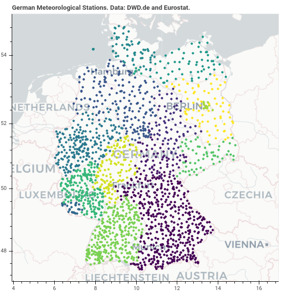

Meteorological data: Germany
============================

Weather data for Germany is extracted from `Deutscher Wetterdienst's Climate Data Center (CDC) OpenData <https://www.dwd.de/EN/climate_environment/cdc/cdc_node.html>`__.

A map of German meteorological stations is shown below\  [1]_.

    A map of German meteorological stations and their metadata, including the station's name, id and height (m), the state and NUTS 3 region it is located in, and its latitude and longitude, made using data from Deutscher Wetterdienst and Eurostat.

.. raw:: html
    :file: _static/dwd_stations.html

.. [1] The interactive map can be viewed on `JSFiddle <https://jsfiddle.net/nithiya/h3mnt20c/>`__.

Automating the data extraction process
--------------------------------------

``scripts/windHourly_de.py`` and ``scripts/solarHourly_de.py`` are the scripts used to extract hourly wind and solar data respectively.

Terms of use
------------

- `Terms of use for data on the CDC ftp server <https://opendata.dwd.de/climate_environment/CDC/Terms_of_use.pdf>`__

References
----------

1. "`Wetter und Klima - Deutscher Wetterdienst - CDC (Climate Data Center) <https://www.dwd.de/EN/climate_environment/cdc/cdc_node.html>`__."
2. "`Mapping geo data using Bokeh - Nithiya Streethran <https://nithiya.gitlab.io/visualisations/mapping-geo-data-bokeh/>`__." 2 February 2020.
