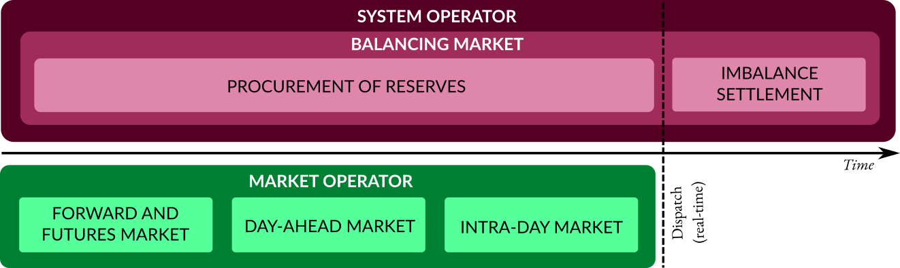

The electricity system
======================

The electricity system can be seen as having two components; the physical grid consisting of generators and transmission and distribution systems, and the electricity market consisting of a number of actors [Erbach2016]_.

The table below shows the characteristics of the main energy generation technologies, including their costs. These generation sources have different variabilities, fuel types, flexibilities, costs and carbon emissions. The costs listed in this table are derived based on National Renewable Energy Laboratory (:term:`NREL`)'s NREL-SEAC 2008 Data Set [Tidball2010]_. :term:`VRE` generation technologies have high capital expenditure (:term:`CAPEX`) compared to conventional fossil-powered and biomass generation. Conversely, the operational expenditure (:term:`OPEX`), which includes fuel and fixed operational and maintenance (:term:`O&M`) costs, is low for :term:`VRE` generation technologies, as they have no fuel costs unlike conventional generators [Joskow2011]_.

.. table:: Characteristics of the main energy generation technologies, adapted from Erbach 2016 and Tidball, et al. 2010. Costs for natural gas, biomass, solar and geothermal are that of advanced combustion turbine, biomass gasification plant, utility-scale photovoltaic and hydrothermal plant respectively. :term:`LCOE` refers to levelised cost of electricity. Biomass is considered low carbon as regrowth of biomass compensates emissions.

   +------------+-------------+-----------+-------------+-----------+--------+--------+--------+
   | Type       | Variability | Fuel type | Flexibility | Emission  | CAPEX  | OPEX   | LCOE   |
   |            |             |           |             | intensity |        |        |        |
   +============+=============+===========+=============+===========+========+========+========+
   | Coal       | none        | fossil    | medium      | very high | low    | high   | very   |
   |            |             |           |             |           |        |        | low    |
   +------------+-------------+-----------+-------------+-----------+--------+--------+--------+
   | Natural    | none        | fossil    | high        | high      | very   | very   | low    |
   | gas        |             |           |             |           | low    | high   |        |
   +------------+-------------+-----------+-------------+-----------+--------+--------+--------+
   | Biomass    | none        | renewable | medium      | low       | low    | very   | very   |
   |            |             |           |             |           |        | high   | high   |
   +------------+-------------+-----------+-------------+-----------+--------+--------+--------+
   | Nuclear    | none        | nuclear   | low         | zero      | medium | medium | medium |
   +------------+-------------+-----------+-------------+-----------+--------+--------+--------+
   | Hydro      | none        | renewable | very high   | zero      |        |        |        |
   +------------+-------------+-----------+-------------+-----------+--------+--------+--------+
   | Solar      | variable    | renewable | very low    | zero      | very   | very   | very   |
   |            |             |           |             |           | high   | low    | high,  |
   +------------+-------------+-----------+-------------+-----------+--------+--------+--------+
   | Onshore    | variable    | renewable | very low    | zero      | high   | very   | very   |
   | wind       |             |           |             |           |        | low    | low    |
   +------------+-------------+-----------+-------------+-----------+--------+--------+--------+
   | Offshore   | variable    | renewable | very low    | zero      | very   | low    | high   |
   | wind       |             |           |             |           | high   |        |        |
   +------------+-------------+-----------+-------------+-----------+--------+--------+--------+
   | Geothermal | none        | renewable | high        | zero      | high   | medium | high   |
   +------------+-------------+-----------+-------------+-----------+--------+--------+--------+

Actors in the electricity market include generators, retailers, large and small consumers, :term:`TSO`s, :term:`DNO`s, balance responsible parties (:term:`BRP`s), aggregators, regulators, and market operators [KULeuven2015]_, [Pinson]_.

There are two types of electricity markets; the retail market and the wholesale market. The retail market involves the retailers buying electricity from generators and selling it to consumers. The wholesale market involves generators, retailers and (large) consumers, who buy and sell electricity. Energy-only transactions in the wholesale market have different temporal resolutions and take place before dispatch, shown in green in the figure below. Balancing markets, shown in pink in the figure, which involve both energy and services, operate both before and after dispatch. The energy-only markets are operated by the market operator or power exchanges, while the balancing market is operated by the system operator. The day-ahead and intra-day markets can be considered short-term electricity markets, as the former takes place 24 hours in advance of dispatch, while the latter takes place continuously after the day-ahead market, up to minutes before dispatch [EuropeanCommission2016]_.

   The various electricity markets in terms of operator and temporal resolution, before and after dispatch, adapted from KU Leuven Energy Institute 2015 and Pinson 2018.

In short-term electricity market auctions, such as the day-ahead market auction, generating companies have the incentive to bid as low as possible, as the supply bids are ranked in ascending order of price. Conversely, on the demand side, consumers have the incentive to bid as high as possible, as the demand bids are ranked in descending order of price. These two curves form a so called merit order, and the intersection between these two curves is the equilibrium point. The price at this equilibrium point is the market clearing price, which is what all accepted bids will receive, regardless of their initial bid. All supply and demand bids to the left of the equilibrium point will be accepted, and those to the right are rejected.

In the case of generating companies, the :term:`OPEX` of their generators determine the price at which it is bid. For conventional power plants, this :term:`OPEX` includes fuel costs and carbon costs (except nuclear power plants). For solar and wind power plants, the :term:`OPEX` is close to zero, as they do not require fuel to run. The revenue received by generating companies in the day-ahead market for each power plant contributes towards their :term:`CAPEX`. Since conventional power plants have relatively low :term:`CAPEX`, and fuel costs are high, the main decision generating companies have to make in short-term electricity markets is whether it is economical to run these power plants. For solar and wind power plants, which have relatively high :term:`CAPEX`, companies are interested in getting as many bids accepted and as much of the electricity generated sold as possible.
