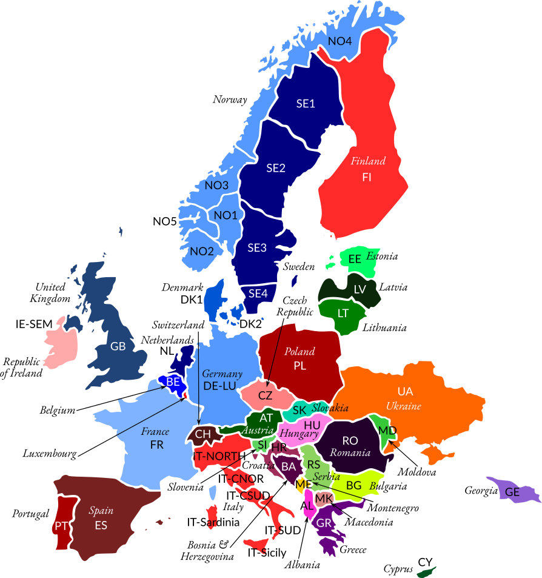

Regions
=======

Territories
-----------

The nomenclature of territorial units for statistics (:term:`NUTS`\) classifies territorial units in Europe in different levels [Ofgem2014]_:

- :term:`NUTS`\  0: country-level
- :term:`NUTS`\  1: major socio-economic regions
- :term:`NUTS`\  2: basic regions for the application of regional policies
- :term:`NUTS`\  3: small regions for specific diagnoses

Bidding zones
-------------

A bidding zone is the largest geographical area within which market participants are able to exchange energy without capacity allocation. There are three types of bidding zones:

1. national borders (e.g., France (:term:`FR`\) or the Netherlands) - majority of bidding zones in Europe
2. larger than national borders (e.g., Germany and Luxembourg or the Single Electricity Market for the island of Ireland)
3. smaller zones within individual countries (e.g., Italy, Norway or Sweden)

The bidding zones in European electricity markets and surrounding regions are illustrated in the map below.

    
    Bidding zones in Europe. This map is created using the base map with bidding zone borders from ENTSO-E Transparency Platform's cross-border physical flow map as a guide.

The table below below lists bidding zones in Europe by country and market operator.

.. table:: Bidding zones and market operators in Europe. Country codes in brackets are according to ISO_3166-1 alpha-2.

    +-----------------+-----------------+-----------------+
    | **Country**     | **Markets**     | **Zones**       |
    +=================+=================+=================+
    | Albania (AL)    |                 | AL              |
    +-----------------+-----------------+-----------------+
    | Bosnia and      |                 | BA              |
    | Herzegovina     |                 |                 |
    | (BA)            |                 |                 |
    +-----------------+-----------------+-----------------+
    | Belgium (BE)    | Belpex          | BE              |
    +-----------------+-----------------+-----------------+
    | Bulgaria (BG)   |                 | BG              |
    +-----------------+-----------------+-----------------+
    | Switzerland     |                 | CH              |
    | (CH)            |                 |                 |
    +-----------------+-----------------+-----------------+
    | Cyprus (CY)     |                 | CY              |
    +-----------------+-----------------+-----------------+
    | Czech Republic  |                 | CZ              |
    | (CZ)            |                 |                 |
    +-----------------+-----------------+-----------------+
    | Germany (DE)    | EEX, EPEX       | DE-LU           |
    +-----------------+-----------------+-----------------+
    | Denmark (DK)    | EEX, Nord Pool  | DK1, DK2        |
    +-----------------+-----------------+-----------------+
    | Estonia (EE)    |                 | EE              |
    +-----------------+-----------------+-----------------+
    | Spain (ES)      |                 | ES              |
    +-----------------+-----------------+-----------------+
    | Finland (FI)    |                 | FI              |
    +-----------------+-----------------+-----------------+
    | France (FR)     | EEX, EPEX       | FR              |
    +-----------------+-----------------+-----------------+
    | Georgia (GE)    |                 | GE              |
    +-----------------+-----------------+-----------------+
    | Greece (GR)     |                 | GR              |
    +-----------------+-----------------+-----------------+
    | Croatia (HR)    |                 | HR              |
    +-----------------+-----------------+-----------------+
    | Hungary (HU)    |                 | HU              |
    +-----------------+-----------------+-----------------+
    | Republic of     |                 | IE-SEM          |
    | Ireland (IE)    |                 |                 |
    +-----------------+-----------------+-----------------+
    | Italy (IT)      |                 | IT-CNOR,        |
    |                 |                 | IT-CSUD,        |
    |                 |                 | IT-NORTH,       |
    |                 |                 | IT-Sardinia,    |
    |                 |                 | IT-Sicily,      |
    |                 |                 | IT-SUD          |
    +-----------------+-----------------+-----------------+
    | Lithuania (LT)  |                 | LT              |
    +-----------------+-----------------+-----------------+
    | Luxembourg (LU) |                 | DE-LU           |
    +-----------------+-----------------+-----------------+
    | Latvia (LV)     |                 | LV              |
    +-----------------+-----------------+-----------------+
    | Moldova (MD)    |                 | MD              |
    +-----------------+-----------------+-----------------+
    | Montenegro (ME) |                 | ME              |
    +-----------------+-----------------+-----------------+
    | North Macedonia |                 | MK              |
    | (MK)            |                 |                 |
    +-----------------+-----------------+-----------------+
    | Netherlands     | APX             | NL              |
    | (NL)            |                 |                 |
    +-----------------+-----------------+-----------------+
    | Norway (NO)     | EEX, Nord Pool  | NO1, NO2, NO3,  |
    |                 |                 | NO4, NO5        |
    +-----------------+-----------------+-----------------+
    | Poland (PL)     |                 | PL              |
    +-----------------+-----------------+-----------------+
    | Portugal (PT)   |                 | PT              |
    +-----------------+-----------------+-----------------+
    | Romania (RO)    |                 | RO              |
    +-----------------+-----------------+-----------------+
    | Serbia (RS)     |                 | RS              |
    +-----------------+-----------------+-----------------+
    | Sweden (SE)     | EEX, Nord Pool  | SE1, SE2, SE3,  |
    |                 |                 | SE4             |
    +-----------------+-----------------+-----------------+
    | Slovenia (SI)   |                 | SI              |
    +-----------------+-----------------+-----------------+
    | Slovakia (SK)   |                 | SK              |
    +-----------------+-----------------+-----------------+
    | Ukraine (UA)    |                 |                 |
    +-----------------+-----------------+-----------------+
    | United Kingdom  | APX, N2EX       | GB, IE-SEM      |
    | (UK)            |                 |                 |
    +-----------------+-----------------+-----------------+

The United Kingdom is comprised of Great Britain (GB) and Northern Ireland. Northern Ireland is part of the Single Electricity Market of the island of Ireland (IE-SEM), which it shares with the Republic of Ireland (IE). Prior to 01/10/2018, Germany was part of the DE-AT-LU bidding zone, together with Austria (AT) and Luxembourg (LU), which had split into the DE-LU and AT bidding zones, as reported by European Network of Transmission Systems Operators for Electricity (:term:`ENTSO-E`\) below:

    *[...] DE-AT-LU bidding zone split on the 23rd of August. BZN|DE-AT-LU will be separated into 2 new bidding zones BZN|DE-LU and BZN|AT.*

    *New bidding zones will be active from the 1st of October, however, first data submissions, like month ahead forecasts, are expected from the 1st of September.*

    *Validity end date for BZN|DE-AT-LU is the end of September 2018. [...]*

Mapping bidding zones to :term:`NUTS`\  3 territories is straightforward for Belgium, Germany, France and Netherlands (bidding zone type 1 or 2) -- all :term:`NUTS`\  3 territories in these countries have the same bidding zone.

Denmark and United Kingdom are both conveniently separated into two zones that are easily distinguishable. For Denmark, these are Western Denmark (:term:`NUTS`\  IDs with prefixes DK03-DK05) and Southern Denmark (:term:`NUTS`\  IDs with prefixes DK01-DK02). For United Kingdom, these are Great Britain (:term:`NUTS`\ IDs with prefixes UKC-UKM) and Northern Ireland (:term:`NUTS`\  IDs with prefixes UKN).

There is no clear indication of the bidding zone boundaries for Norway and Sweden, so some assumptions were made. Both countries have multiple smaller bidding zones (type 3) with flexible borders. This was done to optimise allocation of resources and reduce the overall price of electricity. Norway has five zones and Sweden has four zones. By cross-referencing Nord Pool market data, :term:`NUTS`\  3 data and county maps of Norway and Sweden, the territories are split into the bidding zones as shown in the table below. Nord Pool associates each bidding zone with a major reference city in that zone. However, there were six cities for Norway instead of the expected five. Historical Nord Pool market data for Norway suggests that two cities, Trondheim and Molde, have had the same system price since 2003. The ELSPOT area change log also confirms that Trondheim and Molde are city references for the NO3 bidding zone. Therefore, these two cities are grouped into the same bidding zone, which also satisfies what the maps suggest.

.. table:: Bidding zones and their territories for Norway and Sweden, approximated based on Nord Pool market data, NUTS 3 data and county maps of Norway and Sweden.

    +-----------------+-----------------+-----------------+-----------------+
    | **Bidding       | **Reference     | **Counties**    | **NUTS 3 IDs**  |
    | zone**          | cities**        |                 |                 |
    +=================+=================+=================+=================+
    | NO1             | Oslo            | Oslo, Akershus, | NO011-034       |
    |                 |                 | Hedmark,        |                 |
    |                 |                 | Oppland,        |                 |
    |                 |                 | Østfold,        |                 |
    |                 |                 | Buskerud,       |                 |
    |                 |                 | Vestfold,       |                 |
    |                 |                 | Telemark        |                 |
    +-----------------+-----------------+-----------------+-----------------+
    | NO2             | Kristiansand    | Aust-Agder,     | NO041-043       |
    |                 |                 | Vest-Agder,     |                 |
    |                 |                 | Rogaland        |                 |
    +-----------------+-----------------+-----------------+-----------------+
    | NO3             | Trondheim,      | Sogn og         | NO052-060       |
    |                 | Molde           | Fjordane, Møre  |                 |
    |                 |                 | og Romsdal,     |                 |
    |                 |                 | Trøndelag       |                 |
    +-----------------+-----------------+-----------------+-----------------+
    | NO4             | Tromsø          | Nordland,       | NO071-073       |
    |                 |                 | Troms, Finnmark |                 |
    +-----------------+-----------------+-----------------+-----------------+
    | NO5             | Bergen          | Hordaland       | NO051           |
    +-----------------+-----------------+-----------------+-----------------+
    | SE1             | Luleå           | Norrbotten      | SE332           |
    +-----------------+-----------------+-----------------+-----------------+
    | SE2             | Sundsvall       | Gävleborg,      | SE313-331       |
    |                 |                 | Västernorrland, |                 |
    |                 |                 | Jämtland,       |                 |
    |                 |                 | Västerbotten    |                 |
    +-----------------+-----------------+-----------------+-----------------+
    | SE3             | Stockholm       | Stockholm,      | SE110-211,      |
    |                 |                 | Uppsala,        | SE214,          |
    |                 |                 | Södermanland,   | SE232-312       |
    |                 |                 | Östergötland,   |                 |
    |                 |                 | Örebro,         |                 |
    |                 |                 | Västmanland,    |                 |
    |                 |                 | Jönköping,      |                 |
    |                 |                 | Gotland, Västra |                 |
    |                 |                 | Götaland,       |                 |
    |                 |                 | Värmland,       |                 |
    |                 |                 | Dalarna         |                 |
    +-----------------+-----------------+-----------------+-----------------+
    | SE4             | Malmö           | Kronoberg,      | SE212-213,      |
    |                 |                 | Kalmar,         | SE221-231       |
    |                 |                 | Blekinge,       |                 |
    |                 |                 | Halland, Skåne  |                 |
    +-----------------+-----------------+-----------------+-----------------+

Transmission system operators and interconnections
--------------------------------------------------

Europe has multiple :term:`TSO`\s and cross-border interconnections. These are listed, along with the bidding zones, in the table below.

.. table:: TSOs and cross-border interconnections in Europe. Data: European Network of Transmission System Operators for Electricity.

    +--------------------+--------------------+--------------------+--------------------+
    | **Country**        | **TSOs**           | **Cross-border     | **Bidding          |
    |                    |                    | interconnections** | zones**            |
    +====================+====================+====================+====================+
    | BE                 | Elia System        | FR, LU, NL, UK     | BE                 |
    |                    | Operator           |                    |                    |
    +--------------------+--------------------+--------------------+--------------------+
    | DK                 | Energinet          | DE, NO, SE         | DK1, DK2           |
    +--------------------+--------------------+--------------------+--------------------+
    | DE                 | TransnetBW,        | AT, CH, CZ, DK,    | DE-LU              |
    |                    | TenneT TSO,        | FR, LU, NL, PL,    |                    |
    |                    | Amprion,           | SE                 |                    |
    |                    | 50Hertz            |                    |                    |
    |                    | Transmission       |                    |                    |
    +--------------------+--------------------+--------------------+--------------------+
    | FR                 | Réseau de          | BE, CH, DE, ES,    | FR                 |
    |                    | Transport          | IT, UK             |                    |
    |                    | d’Electricité      |                    |                    |
    +--------------------+--------------------+--------------------+--------------------+
    | NL                 | TenneT TSO         | BE, DE, NO, UK     | NL                 |
    +--------------------+--------------------+--------------------+--------------------+
    | NO                 | Statnett           | DK, FI, NL, SE     | NO1, NO2, NO3,     |
    |                    |                    |                    | NO4, NO5           |
    +--------------------+--------------------+--------------------+--------------------+
    | SE                 | Svenska            | DK, FI, DE, LT,    | SE1, SE2, SE3,     |
    |                    | Kraftnät           | NO, PL             | SE4                |
    +--------------------+--------------------+--------------------+--------------------+
    | UK                 | National Grid      | BE, FR, IE, NL     | GB, IE-SEM         |
    |                    | Electricity        |                    |                    |
    |                    | Transmission,      |                    |                    |
    |                    | System Operator    |                    |                    |
    |                    | for Northern       |                    |                    |
    |                    | Ireland,           |                    |                    |
    |                    | Scottish Hydro     |                    |                    |
    |                    | Electric           |                    |                    |
    |                    | Transmission,      |                    |                    |
    |                    | ScottishPower      |                    |                    |
    |                    | Transmission       |                    |                    |
    +--------------------+--------------------+--------------------+--------------------+
